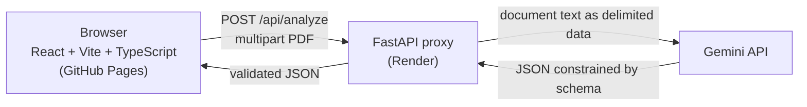

# PDF Insight

[](https://github.com/mwaveff/PDF_insight/actions/workflows/deploy.yml)

Drop a PDF (up to 10 MB) and get a 3-5 sentence summary plus the document's data as structured
JSON: type, key points, entities, amounts, dates and keywords. The model extracts only what is
written in the document and never invents data.

**Live demo:** https://mwaveff.github.io/PDF_insight/

> The demo backend runs on a free Render instance, so the first request after a period of
> inactivity can take about a minute while the server wakes up.

## Features

- Drag-and-drop upload (or file picker) with client-side checks: PDF only, max 10 MB.
- Reads the PDF text layer. Scans without a text layer are rejected with a clear message.
- Summary written in the **same language as the document**.
- JSON output that strictly follows a fixed schema: dates in **ISO 8601**, currencies in
  **ISO 4217**.
- Download the result as a `.json` file.
- Empty state, loading state, and error state with a **retry** button.

## Architecture

GitHub Pages serves only static files, so the Gemini API key lives in a small proxy backend.



1. The browser sends the PDF to `POST /api/analyze`.
2. The backend validates the file (magic bytes, size) and extracts the text layer with `pypdf`.
3. The text is sent to Gemini as delimited data. Output is constrained by a response schema and
   validated again with pydantic. The file name and page count come from the server, not the model.
4. The frontend validates the response with zod before rendering.

## Output example

```json
{
  "type": "faktura",
  "document": {
    "fileName": "invoice.pdf",
    "pages": 1,
    "language": "pl",
    "title": "Faktura nr 1/2026",
    "date": "2026-03-05"
  },
  "summary": "Dokument to faktura o numerze 1/2026 wystawiona w dniu 5 marca 2026 roku. ...",
  "keyPoints": ["Kwota do zapłaty wynosi 1500 PLN."],
  "entities": { "organizations": ["Acme Sp. z o.o."], "people": [] },
  "amounts": [{ "value": 1500, "currency": "PLN", "context": "Kwota faktury" }],
  "dates": [{ "date": "2026-03-05", "context": "Data wystawienia faktury" }],
  "keywords": ["faktura", "Acme"]
}
```

`type` is one of `umowa`, `faktura`, `oferta`, `raport`, `inne`. The UI is in Polish on purpose:
these types target Polish business documents. The schema lives in
[`frontend/src/types/schema.ts`](frontend/src/types/schema.ts) and mirrors the pydantic models in
[`main.py`](main.py).

## Tech stack

| Layer    | Technology                                                       |
| -------- | ---------------------------------------------------------------- |
| Frontend | React, Vite, strict TypeScript, Tailwind CSS, zod                |
| Backend  | Python, FastAPI, pypdf, pydantic, Google Gen AI SDK              |
| Tooling  | ESLint, Prettier, conventional commits                           |
| CI/CD    | GitHub Actions (lint, format check, build, deploy to Pages)      |
| Hosting  | GitHub Pages (frontend), Render (backend)                        |

## Security

- **API key:** `GEMINI_API_KEY` lives only in the backend environment. `.env` is git-ignored and
  the key is not in the Git history.
- **CORS:** only `ALLOWED_ORIGIN` (the demo domain) is allowed, with no credentials.
- **Prompt injection:** the document is wrapped in a random boundary marker, the system
  instruction declares it untrusted data, the file name is never put in the prompt, and the
  output is schema-validated. PDF content is treated strictly as data.
- **Rate limit:** per-IP sliding window (`RATE_LIMIT_REQUESTS` per `RATE_LIMIT_WINDOW_S`, in
  memory), because CORS only restricts browsers, not scripts.
- **Errors:** upstream errors are logged server-side and never returned to the client.

## Run locally

```bash
# backend
python -m venv .venv && .venv/Scripts/activate   # source .venv/bin/activate on Linux/macOS
pip install -r requirements.txt
cp .env.example .env                              # set GEMINI_API_KEY and ALLOWED_ORIGIN=http://localhost:5173
uvicorn main:app --reload

# frontend (in a second terminal)
cd frontend
npm ci
echo VITE_API_URL=http://localhost:8000/api/analyze > .env.local
npm run dev
```

Checks: `npm run lint`, `npm run format:check`, `npm run typecheck`, `npm run build`.

## Configuration

Backend environment variables (see [`.env.example`](.env.example)):

| Variable                | Default                                   | Description                                   |
| ----------------------- | ----------------------------------------- | --------------------------------------------- |
| `GEMINI_API_KEY`        | (required)                                | Gemini API key. Never commit it.              |
| `ALLOWED_ORIGIN`        | `https://mwaveff.github.io`               | The only origin allowed by CORS (no path).    |
| `GEMINI_MODELS`         | `gemini-3.5-flash,gemini-3.5-flash-lite`  | Models to try in order.                       |
| `RATE_LIMIT_REQUESTS`   | `10`                                      | Requests allowed per IP per window.           |
| `RATE_LIMIT_WINDOW_S`   | `600`                                     | Rate limit window in seconds.                 |

Frontend: `VITE_API_URL` overrides the backend URL at build time.

## Deployment

- **Frontend:** push to `main`. `.github/workflows/deploy.yml` lints, checks formatting, builds
  and publishes to GitHub Pages.
- **Backend:** any Python host (the demo uses Render).
  - Build command: `pip install -r requirements.txt`
  - Start command: `uvicorn main:app --host 0.0.0.0 --port $PORT`
  - Set `GEMINI_API_KEY` and `ALLOWED_ORIGIN` as environment variables in the host's dashboard.

## Limitations

- Scanned PDFs (no text layer) are not supported, there is no OCR.
- Only the first 200,000 characters of text are analyzed.
- The free Gemini tier has low rate limits, so the demo can return a temporary error under load.
